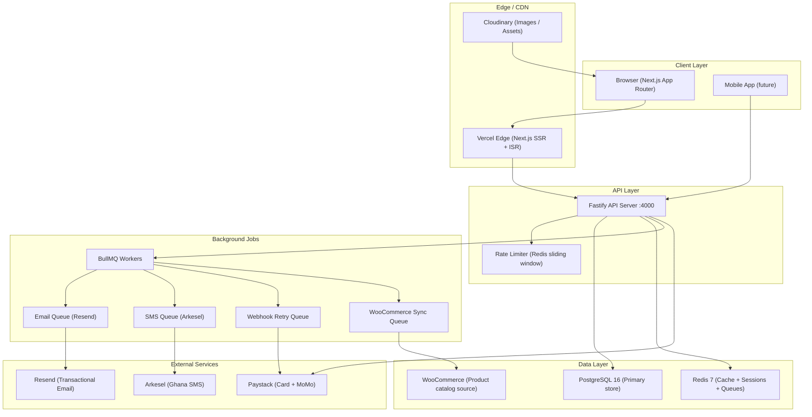
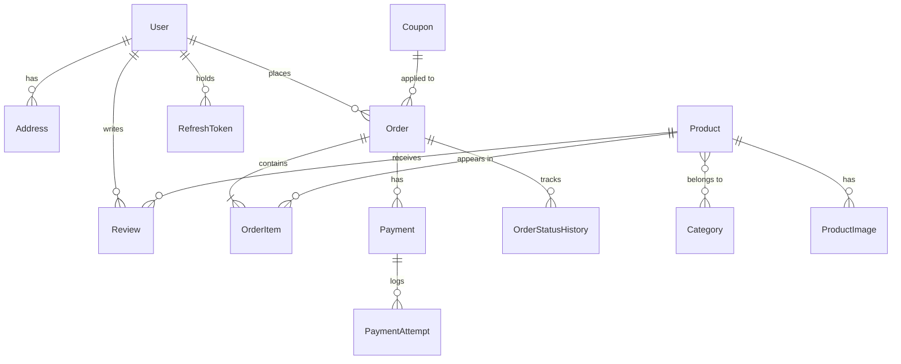

# NextDor Backend — Production Architecture

> Living document. Updated as each phase is built.
> Last updated: 2026-08-31

---

## 1. Stack Decision

### Candidates evaluated

| Criterion | **Node.js + Fastify** | FastAPI (Python) |
|---|---|---|
| Language alignment with frontend | ✅ TypeScript end-to-end | ❌ Python — separate type systems |
| Shared types (`packages/shared`) | ✅ Zod schemas shared directly | ❌ Requires code-gen bridge |
| Raw performance | ✅ Fastify ~76k req/s | ✅ Comparable (~70k req/s) |
| Async I/O model | ✅ Node event loop, perfect for I/O-bound e-commerce | ✅ asyncio |
| Payment SDK ecosystem (Paystack) | ✅ First-class Node SDK | ⚠️ Community wrapper only |
| ORM quality | ✅ Prisma — type-safe, excellent migrations | ✅ SQLAlchemy + Alembic |
| Job queue | ✅ BullMQ (Redis-native, battle-tested) | ⚠️ Celery (heavier) |
| Deployment footprint | ✅ Small single process | ⚠️ Requires Python runtime |
| Team skill transferability | ✅ Same language as frontend devs | ❌ Context switch |

### ✅ Decision: **Node.js 20 LTS + Fastify v5**

Reasons:
1. **Type safety end-to-end** — Zod schemas live in `packages/shared`, consumed by both Next.js and Fastify with zero duplication.
2. **Paystack** (Ghana's dominant payment gateway — MoMo, Visa, Mastercard) has an official Node SDK.
3. **Fastify** is consistently faster than Express and has built-in schema validation, OpenAPI generation, and a plugin ecosystem purpose-built for production APIs.
4. **Prisma** gives us type-safe database access, migrations as code, and a clean query API.
5. **BullMQ** handles async jobs (order emails, SMS, webhook retries) on top of the same Redis instance used for caching.

---

## 2. Full System Architecture



---

## 3. Repository Layout

```
NextDor/
├── next-frontend/          # Next.js 15 App Router
├── next-backend/           # Fastify API
│   ├── src/
│   │   ├── app.ts          # Fastify instance + plugin registration
│   │   ├── server.ts       # Entry point (listen)
│   │   ├── config/         # Environment config (zod-validated)
│   │   ├── modules/        # Feature modules (vertical slices)
│   │   │   ├── auth/
│   │   │   ├── users/
│   │   │   ├── products/
│   │   │   ├── orders/
│   │   │   ├── payments/
│   │   │   ├── reviews/
│   │   │   ├── cart/
│   │   │   ├── coupons/
│   │   │   └── admin/
│   │   ├── lib/
│   │   │   ├── prisma.ts
│   │   │   ├── redis.ts
│   │   │   ├── queue.ts
│   │   │   ├── logger.ts
│   │   │   └── errors.ts
│   │   ├── plugins/
│   │   │   ├── auth.ts
│   │   │   ├── cors.ts
│   │   │   ├── rateLimit.ts
│   │   │   └── swagger.ts
│   │   └── workers/
│   │       ├── email.worker.ts
│   │       ├── sms.worker.ts
│   │       ├── payment.worker.ts
│   │       └── sync.worker.ts
│   ├── prisma/
│   │   ├── schema.prisma
│   │   └── migrations/
│   ├── tests/
│   └── package.json
└── packages/
    └── shared/             # Zod schemas + TS types shared by both apps
        ├── src/
        │   ├── schemas/
        │   │   ├── auth.ts
        │   │   ├── order.ts
        │   │   ├── product.ts
        │   │   └── user.ts
        │   └── index.ts
        └── package.json
```

---

## 4. Database Schema (PostgreSQL + Prisma)

### Design principles
- **UUID v4** primary keys via `gen_random_uuid()` (no enumeration attacks)
- **Soft deletes** on User, Product, Order (`deletedAt`)
- **Audit columns** (`createdAt`, `updatedAt`) on every table
- **Immutable financial records** — OrderItem and Payment rows are never UPDATEd
- **Indexes** on all FKs, filter columns, and full-text search columns
- **Price as Decimal(12,2)** — never Float (floating-point money bugs)

### Entity relationship



### Prisma schema

```prisma
generator client {
  provider = "prisma-client-js"
}

datasource db {
  provider = "postgresql"
  url      = env("DATABASE_URL")
}

// ─── Users & Auth ──────────────────────────────────────────────────

model User {
  id            String     @id @default(dbgenerated("gen_random_uuid()")) @db.Uuid
  email         String     @unique
  emailVerified Boolean    @default(false)
  passwordHash  String
  name          String
  phone         String?
  role          UserRole   @default(CUSTOMER)
  status        UserStatus @default(ACTIVE)
  createdAt     DateTime   @default(now())
  updatedAt     DateTime   @updatedAt
  deletedAt     DateTime?

  addresses     Address[]
  orders        Order[]
  reviews       Review[]
  refreshTokens RefreshToken[]

  @@index([email])
  @@index([deletedAt])
}

enum UserRole   { CUSTOMER ADMIN }
enum UserStatus { ACTIVE SUSPENDED }

model RefreshToken {
  id        String    @id @default(dbgenerated("gen_random_uuid()")) @db.Uuid
  userId    String    @db.Uuid
  tokenHash String    @unique   // bcrypt hash of the opaque token
  family    String              // token family for rotation detection
  expiresAt DateTime
  revokedAt DateTime?
  createdAt DateTime  @default(now())

  user      User      @relation(fields: [userId], references: [id], onDelete: Cascade)

  @@index([userId])
  @@index([family])
}

model Address {
  id        String   @id @default(dbgenerated("gen_random_uuid()")) @db.Uuid
  userId    String   @db.Uuid
  label     String   @default("Home")
  street    String
  city      String
  region    String
  isDefault Boolean  @default(false)
  createdAt DateTime @default(now())
  updatedAt DateTime @updatedAt

  user      User     @relation(fields: [userId], references: [id], onDelete: Cascade)
  orders    Order[]

  @@index([userId])
}

// ─── Catalog ───────────────────────────────────────────────────────

model Category {
  id          String     @id @default(dbgenerated("gen_random_uuid()")) @db.Uuid
  wcId        Int?       @unique
  name        String
  slug        String     @unique
  description String?
  imageUrl    String?
  parentId    String?    @db.Uuid
  sortOrder   Int        @default(0)

  parent      Category?  @relation("CategoryTree", fields: [parentId], references: [id])
  children    Category[] @relation("CategoryTree")
  products    Product[]  @relation("ProductCategories")

  @@index([slug])
  @@index([parentId])
}

model Product {
  id            String        @id @default(dbgenerated("gen_random_uuid()")) @db.Uuid
  wcId          Int?          @unique
  slug          String        @unique
  name          String
  description   String
  shortDesc     String?
  price         Decimal       @db.Decimal(12, 2)
  salePrice     Decimal?      @db.Decimal(12, 2)
  currency      String        @default("GHS")
  stockStatus   StockStatus   @default(IN_STOCK)
  stockQty      Int?
  averageRating Decimal       @default(0) @db.Decimal(3, 2)
  reviewCount   Int           @default(0)
  sortOrder     Int           @default(0)
  createdAt     DateTime      @default(now())
  updatedAt     DateTime      @updatedAt
  deletedAt     DateTime?

  categories    Category[]    @relation("ProductCategories")
  images        ProductImage[]
  orderItems    OrderItem[]
  reviews       Review[]

  @@index([slug])
  @@index([deletedAt])
  @@index([stockStatus])
}

enum StockStatus { IN_STOCK OUT_OF_STOCK LOW_STOCK }

model ProductImage {
  id        String  @id @default(dbgenerated("gen_random_uuid()")) @db.Uuid
  productId String  @db.Uuid
  url       String
  alt       String  @default("")
  sortOrder Int     @default(0)

  product   Product @relation(fields: [productId], references: [id], onDelete: Cascade)

  @@index([productId])
}

// ─── Orders ────────────────────────────────────────────────────────

model Order {
  id              String               @id @default(dbgenerated("gen_random_uuid()")) @db.Uuid
  number          String               @unique        // ND-XXXXX
  userId          String?              @db.Uuid
  guestEmail      String?
  addressId       String?              @db.Uuid
  shippingAddress Json                 // Immutable snapshot at checkout
  subtotal        Decimal              @db.Decimal(12, 2)
  deliveryFee     Decimal              @db.Decimal(12, 2)
  discount        Decimal              @default(0) @db.Decimal(12, 2)
  total           Decimal              @db.Decimal(12, 2)
  currency        String               @default("GHS")
  status          OrderStatus          @default(PENDING)
  paymentStatus   PaymentStatus        @default(UNPAID)
  deliveryMethod  DeliveryMethod       @default(STANDARD)
  couponId        String?              @db.Uuid
  notes           String?
  createdAt       DateTime             @default(now())
  updatedAt       DateTime             @updatedAt

  user            User?                @relation(fields: [userId], references: [id])
  address         Address?             @relation(fields: [addressId], references: [id])
  items           OrderItem[]
  payments        Payment[]
  statusHistory   OrderStatusHistory[]
  coupon          Coupon?              @relation(fields: [couponId], references: [id])

  @@index([userId])
  @@index([number])
  @@index([status])
  @@index([createdAt])
}

enum OrderStatus    { PENDING CONFIRMED PROCESSING SHIPPED DELIVERED CANCELLED REFUNDED }
enum PaymentStatus  { UNPAID PARTIAL PAID REFUNDED }
enum DeliveryMethod { STANDARD EXPRESS PICKUP }

model OrderStatusHistory {
  id        String      @id @default(dbgenerated("gen_random_uuid()")) @db.Uuid
  orderId   String      @db.Uuid
  status    OrderStatus
  note      String?
  createdBy String?     @db.Uuid
  createdAt DateTime    @default(now())

  order     Order       @relation(fields: [orderId], references: [id], onDelete: Cascade)

  @@index([orderId])
}

model OrderItem {
  id           String   @id @default(dbgenerated("gen_random_uuid()")) @db.Uuid
  orderId      String   @db.Uuid
  productId    String   @db.Uuid
  productName  String               // Snapshot — immutable
  productImage String?              // Snapshot — immutable
  unitPrice    Decimal  @db.Decimal(12, 2)
  quantity     Int
  subtotal     Decimal  @db.Decimal(12, 2)

  order        Order    @relation(fields: [orderId], references: [id], onDelete: Cascade)
  product      Product  @relation(fields: [productId], references: [id])

  @@index([orderId])
  @@index([productId])
}

// ─── Payments ──────────────────────────────────────────────────────

model Payment {
  id           String          @id @default(dbgenerated("gen_random_uuid()")) @db.Uuid
  orderId      String          @db.Uuid
  paystackRef  String          @unique
  method       PaymentMethod
  amount       Decimal         @db.Decimal(12, 2)
  currency     String          @default("GHS")
  status       PaymentTxStatus @default(PENDING)
  metadata     Json?
  paidAt       DateTime?
  createdAt    DateTime        @default(now())

  order        Order           @relation(fields: [orderId], references: [id])
  attempts     PaymentAttempt[]

  @@index([orderId])
  @@index([paystackRef])
}

enum PaymentMethod   { MOMO CARD BANK_TRANSFER }
enum PaymentTxStatus { PENDING SUCCESS FAILED REFUNDED }

model PaymentAttempt {
  id          String   @id @default(dbgenerated("gen_random_uuid()")) @db.Uuid
  paymentId   String   @db.Uuid
  status      String
  gatewayResp Json
  createdAt   DateTime @default(now())

  payment     Payment  @relation(fields: [paymentId], references: [id])

  @@index([paymentId])
}

// ─── Reviews ───────────────────────────────────────────────────────

model Review {
  id        String   @id @default(dbgenerated("gen_random_uuid()")) @db.Uuid
  productId String   @db.Uuid
  userId    String?  @db.Uuid
  guestName String?
  rating    Int      // 1–5, check constraint added in migration
  title     String
  body      String
  verified  Boolean  @default(false)  // purchased the product
  approved  Boolean  @default(false)  // admin moderation gate
  helpful   Int      @default(0)
  createdAt DateTime @default(now())

  product   Product  @relation(fields: [productId], references: [id], onDelete: Cascade)
  user      User?    @relation(fields: [userId], references: [id])

  @@index([productId, approved])
  @@index([userId])
}

// ─── Coupons ───────────────────────────────────────────────────────

model Coupon {
  id          String       @id @default(dbgenerated("gen_random_uuid()")) @db.Uuid
  code        String       @unique
  type        DiscountType
  value       Decimal      @db.Decimal(10, 2)
  minOrderAmt Decimal?     @db.Decimal(12, 2)
  maxUses     Int?
  usedCount   Int          @default(0)
  expiresAt   DateTime?
  active      Boolean      @default(true)
  createdAt   DateTime     @default(now())

  orders      Order[]

  @@index([code])
}

enum DiscountType { FIXED PERCENTAGE }
```

---

## 5. Caching Strategy (Redis)

### Cache layers

| Layer | Key pattern | TTL | Invalidated by |
|---|---|---|---|
| Product page | `product:{slug}` | 5 min | WC sync job or admin edit |
| Product list | `products:list:{hash}` | 3 min | New product, edit, delete |
| Category tree | `categories:tree` | 15 min | Admin edit |
| Homepage featured | `home:featured` | 10 min | Manual flush |
| User session | `session:{userId}` | 1 hour | Logout |
| Rate limit counter | `rl:{ip}:{route}` | 1 min sliding | Auto-expire |
| Server-side cart | `cart:{sessionId}` | 7 days | Checkout / clear |
| WC sync lock | `lock:wc-sync` | 30 sec | Released after sync |

### Redis data structures used

| Use case | Redis type | Rationale |
|---|---|---|
| Product / category cache | String (JSON) | Simple O(1) get/set |
| Cart contents | Hash | Per-item updates without full re-serialisation |
| Rate limiting | Sorted Set (sliding log) | O(log N) window check, no memory leak |
| Popular products (leaderboard) | Sorted Set (score = view count) | O(log N) ZRANGEBYSCORE |
| User session | Hash | Structured, partial updates with HSET |
| Pub/Sub cache invalidation | Pub/Sub channel | Broadcast to all API instances |
| BullMQ job queues | List + Sorted Set | Managed internally by BullMQ |

### Cache-aside read flow

```
Request → Redis GET →
  HIT  → return JSON  (< 1ms)
  MISS → Postgres query → Redis SET with TTL → return
```

### Write-through invalidation (admin mutations)

```
PATCH /admin/products/:id
  → UPDATE Postgres
  → DEL Redis product:{slug}
  → DEL Redis products:list:*  (scan + delete)
  → return updated product
```

---

## 6. Authentication & Security

### Auth flow

```
Register
  → validate with Zod
  → check email unique
  → bcrypt(password, rounds=12)
  → INSERT User
  → enqueue email verification job
  → return 201

Login
  → find User by email
  → bcrypt.compare(password, hash)
  → generate accessToken  (JWT, 15 min, HS256)
  → generate refreshToken (crypto.randomBytes(64).toString('hex'))
  → hash refresh token with bcrypt
  → INSERT RefreshToken { tokenHash, family: uuid(), expiresAt: +30d }
  → set httpOnly cookie: refresh_token=<raw_token>; SameSite=Strict; Secure
  → return { accessToken, user }

Refresh
  → read refresh_token cookie
  → find RefreshToken where tokenHash = bcrypt.compare(...)
  → if not found → 401
  → if revokedAt set → revoke entire family → 401 (reuse attack detected)
  → if expired → 401
  → REVOKE old token, ISSUE new token pair (rotation)
  → return { accessToken }
```

### Token family rotation (theft detection)

```
Family F1: token_A [active]
  ↓ legitimate refresh
Family F1: token_A [revoked], token_B [active]
  ↓ attacker replays token_A
Family F1: ALL REVOKED → user must re-login
```

### Security controls

| Control | Implementation |
|---|---|
| Password hashing | bcrypt, cost factor 12 |
| JWT secret | 64-byte CSPRNG, stored in env, never in code |
| Refresh tokens | Opaque + hashed in DB; httpOnly, SameSite=Strict, Secure cookie |
| Rate limiting | Redis sliding window — 10 req/15min on auth, 1000 req/15min general |
| Input validation | Zod schema on every route input (body, params, query) |
| SQL injection | Prisma parameterised queries — zero raw string interpolation |
| XSS | API returns JSON only; no server-rendered HTML |
| CORS | Allowlist: `nextdor.online`, `localhost:3000` |
| Security headers | `@fastify/helmet`: CSP, HSTS, X-Frame-Options, Referrer-Policy |
| CSRF | SameSite cookie + `X-Requested-With` header double-submit |
| Secrets management | Zod-validated env at startup — app refuses to start if missing |
| Webhook integrity | Paystack HMAC-SHA512 signature on raw body before processing |
| Admin guard | `role === ADMIN` check in Fastify `preHandler` hook |
| Audit trail | Every order/payment state change in `OrderStatusHistory` |
| PII in logs | User IDs only — never log email, phone, or card data |

---

## 7. Payment Integration (Paystack)

Paystack is Ghana's production-grade payment gateway:
- ✅ **MTN MoMo, Vodafone Cash, AirtelTigo Money**
- ✅ **Visa / Mastercard** (local + international)
- ✅ **GHS natively** (no currency conversion needed)
- ✅ Official Node.js SDK
- ✅ Webhook support with HMAC signature verification

### Payment flow

```
1. POST /api/v1/orders
   → create Order (status: PENDING, paymentStatus: UNPAID)
   → create Payment row (status: PENDING)
   → call Paystack: transactions.initialize({
       reference, amount_in_kobo, email, currency: "GHS",
       metadata: { orderId, items }
     })
   → return { authorizationUrl, reference } to client

2. Client redirects to Paystack hosted page

3. User completes payment

4. Paystack calls POST /api/v1/webhooks/paystack
   → verify HMAC-SHA512 signature
   → enqueue payment.webhook job in BullMQ

5. Worker processes job:
   → call Paystack: transactions.verify(reference)
   → if status === "success":
       UPDATE Payment { status: SUCCESS, paidAt }
       UPDATE Order   { paymentStatus: PAID, status: CONFIRMED }
       INSERT OrderStatusHistory { status: CONFIRMED }
       enqueue email.job + sms.job
   → if status === "failed":
       UPDATE Payment { status: FAILED }
       UPDATE Order   { status: CANCELLED }
```

### Webhook HMAC verification

```typescript
import crypto from "node:crypto";

function verifyPaystackWebhook(rawBody: Buffer, signature: string): boolean {
  const expected = crypto
    .createHmac("sha512", process.env.PAYSTACK_SECRET_KEY!)
    .update(rawBody)
    .digest("hex");
  // Constant-time comparison to prevent timing attacks
  return crypto.timingSafeEqual(
    Buffer.from(expected, "utf8"),
    Buffer.from(signature, "utf8"),
  );
}
```

---

## 8. Job Queues (BullMQ)

### Queue definitions

| Queue | Triggered by | Action |
|---|---|---|
| `email` | Order confirmed / shipped / cancelled | Resend transactional email |
| `sms` | Order confirmed, OTP, delivery update | Arkesel SMS (Ghana) |
| `payment-webhook` | Paystack POST webhook | Verify + update order/payment |
| `wc-sync` | Cron every 5 minutes | Fetch WC products → upsert Postgres → flush Redis |
| `review-approved` | Admin approves a review | Recalculate product `averageRating` + `reviewCount` |

### Retry strategy

```
Attempt 1: immediate
Attempt 2: +30 seconds
Attempt 3: +5 minutes
Attempt 4: +30 minutes
Attempt 5: +2 hours
→ Dead Letter Queue → admin alert via email
```

---

## 9. API Design Standards

### Base URL
```
https://api.nextdor.online/v1
```

### Response envelope

```json
// Success
{
  "success": true,
  "data": { ... },
  "meta": { "page": 1, "total": 240, "totalPages": 20 }
}

// Error
{
  "success": false,
  "error": {
    "code": "INVALID_CREDENTIALS",
    "message": "Email or password is incorrect.",
    "details": []
  }
}
```

### Route map

```
Auth
  POST   /auth/register
  POST   /auth/login
  POST   /auth/refresh
  POST   /auth/logout
  POST   /auth/forgot-password
  POST   /auth/reset-password

Users (authenticated)
  GET    /users/me
  PATCH  /users/me
  GET    /users/me/addresses
  POST   /users/me/addresses
  PATCH  /users/me/addresses/:id
  DELETE /users/me/addresses/:id

Products
  GET    /products               ?page&limit&sort&category&search
  GET    /products/:slug
  GET    /products/:slug/reviews

Orders (authenticated)
  POST   /orders
  GET    /orders
  GET    /orders/:id

Reviews (authenticated)
  POST   /products/:slug/reviews

Cart (session-based, Redis)
  GET    /cart
  POST   /cart/items
  PATCH  /cart/items/:productId
  DELETE /cart/items/:productId
  DELETE /cart

Payments
  POST   /payments/initiate
  GET    /payments/:reference/status

Webhooks (no auth — signature verified)
  POST   /webhooks/paystack

Admin (role: ADMIN)
  GET    /admin/orders           ?status&page
  PATCH  /admin/orders/:id/status
  GET    /admin/products
  POST   /admin/products
  PATCH  /admin/products/:id
  DELETE /admin/products/:id
  GET    /admin/customers
  GET    /admin/analytics/summary
  GET    /admin/reviews          ?approved=false
  PATCH  /admin/reviews/:id/approve
  DELETE /admin/reviews/:id
```

---

## 10. Observability

| Concern | Tool |
|---|---|
| Structured logging | Pino (JSON, log levels, requestId trace) |
| Request tracing | `fastify-request-context` |
| Error tracking | Sentry Node SDK |
| Health check | `GET /health` → DB ping + Redis ping |
| API documentation | Swagger UI auto-generated from Fastify schemas |

---

## 11. Deployment Topology

```
Production
  Vercel              → Next.js frontend (SSR + ISR + Edge)
  Railway / Render    → Fastify API (2 instances, auto-scale)
  Neon / Supabase     → PostgreSQL (managed, daily backups, PITR)
  Upstash             → Redis (serverless, persistent)
  Railway             → BullMQ workers (separate process)
  Cloudinary          → Product images + assets

Development
  Docker Compose      → Postgres + Redis + API + Workers, all local
```

---

## 12. Build Phases

### Phase 1 — Foundation ← We start here
- [x] Architecture documented
- [ ] `next-backend` scaffold (Fastify + TypeScript + Prisma)
- [ ] `packages/shared` Zod schemas
- [ ] Docker Compose (Postgres + Redis local)
- [ ] All Prisma migrations
- [ ] Config validation at startup
- [ ] Logger + error handler + health check

### Phase 2 — Auth
- [ ] Register, login, refresh, logout
- [ ] Email verification job
- [ ] Forgot/reset password (OTP via email)
- [ ] Rate limiting on auth routes
- [ ] Swap Next.js auth stubs for real API

### Phase 3 — Catalog & Cart
- [ ] WooCommerce sync cron worker
- [ ] `GET /products` (paginated, cached)
- [ ] `GET /products/:slug` (cache-aside)
- [ ] Server-side cart (Redis hash)

### Phase 4 — Orders & Payments
- [ ] `POST /orders` (validate, snapshot prices, create)
- [ ] Paystack initialise + webhook handler
- [ ] Email + SMS workers
- [ ] Order history API

### Phase 5 — Reviews + Admin
- [ ] Product reviews with verified-purchase check
- [ ] Admin order/product/review management
- [ ] Analytics aggregate queries (dashboard data)

---

## 13. Technology Versions

| Package | Version | Purpose |
|---|---|---|
| Node.js | 20 LTS | Runtime |
| Fastify | ^5.0 | HTTP framework |
| Prisma | ^5.0 | ORM + migrations |
| ioredis | ^5.0 | Redis client |
| bullmq | ^5.0 | Job queue |
| zod | ^3.0 | Schema validation |
| jsonwebtoken | ^9.0 | JWT |
| bcryptjs | ^2.4 | Password hashing |
| @paystack/paystack-sdk | ^1.0 | Payment gateway |
| pino | ^9.0 | Logger |
| @fastify/helmet | ^12.0 | Security headers |
| @fastify/cors | ^9.0 | CORS |
| @fastify/rate-limit | ^9.0 | Rate limiting |
| @fastify/swagger | ^8.0 | OpenAPI docs |
| @fastify/cookie | ^9.0 | httpOnly cookies |
| vitest | ^1.0 | Unit + integration tests |
| tsx | ^4.0 | TypeScript execution |

---

> **Next step**: Approve → begin Phase 1 scaffolding.
