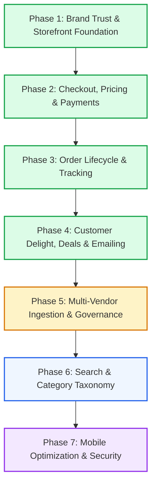

# NextDor — Master Phased Implementation Roadmap
> **Platform Motto:** *"Shop More, Wait Less"*  
> **Status:** Enterprise Multi-Vendor Marketplace (Ghana)  
> **Architecture:** Next.js 16 (App Router + React 19) + Fastify v5 + Prisma ORM (Neon PostgreSQL)  
> **Currency:** Ghanaian Cedis (GH₵ / GHS)  
> **Updated:** October 2026  

---

## 🧭 Executive Overview

This master document groups all **38 client recommendations** and core business requirements into **7 structured, enterprise-ready phases**. Each phase defines its scope, deliverables, verification criteria, and current completion status.



---

## 🟢 Phase 1: Brand Trust, Buyer Confidence & Storefront Foundation
**Status: COMPLETED (100%)**

| ID | Item | Implementation & Verification |
| :--- | :--- | :--- |
| **#1** | **Review Count & Rating Consistency** | Standardized across all `ProductCard`, `ProductRow`, and product detail pages (`reviewCount`, `rating`). |
| **#2 & #3** | **NextDor Ghana Contact & Address** | Replaced placeholders with real Accra, Ghana physical address and contact phone number (`+233 55 123 4567`). |
| **#6** | **"Buy Now" Button** | Direct 1-click purchase button added alongside "Add to Cart", routing straight to checkout. |
| **#9 & #10** | **Delivery Cost & Time on Product Pages** | `ProductDeliveryInfo.tsx` displays regional delivery costs (Accra: GH₵25, Kumasi: GH₵35, Nationwide: GH₵45) and delivery windows (1–2 days Accra, 2–4 days nationwide). |
| **#22 & #23** | **Rich Product Specifications & Gallery** | Multi-image zoom gallery (`ProductGallery.tsx`), specifications tab (`ProductSpecifications.tsx`), and warranty details. |
| **#25 & #26** | **Seller Storefront Cards & Verified Badges** | Vendor store cards on PDP with verified merchant badges and rating metrics. |
| **#32** | **Buyer Protection Escrow Guarantee** | 48-Hour Escrow Guarantee banner and trust markers across storefront, PDP, and checkout. |
| **#33** | **Floating Customer Support Button** | Bottom-right hovering support widget (`FloatingSupportButton.tsx`) with WhatsApp, direct phone call, email, and quick track order modal. |

---

## 🟢 Phase 2: Checkout, Pricing Integrity & Payment Gateways
**Status: COMPLETED (100%)**

| ID | Item | Implementation & Verification |
| :--- | :--- | :--- |
| **#4 & #5** | **Complete Checkout & Server-Side Paystack** | Full checkout pipeline (`/cart` $\rightarrow$ `/checkout` $\rightarrow$ Paystack modal $\rightarrow$ `/checkout/success`). Payments verified server-side (`POST /api/v1/orders/verify-payment`) with Paystack API HMAC validation. |
| **#7** | **Guest Checkout** | Frictionless guest checkout supporting instant purchase with only email and phone number; no mandatory account barrier. |
| **#8** | **Transparent Fee Breakdown** | Order summary card displaying Subtotal, Delivery Fee, Buyer Protection, and Grand Total in GH₵ before payment. |
| **#11** | **Dynamic Delivery Region Selection** | Interactive Ghana region selector (Greater Accra, Ashanti, Central, Western, Eastern, Northern) with auto-recalculated delivery fees. |
| **#18 & #19** | **Atomic Stock Management** | Database transaction decrements stock on payment confirmation; out-of-stock items blocked from purchase. |
| **#35** | **Dynamic Price Display & Discount %** | Compare-at strikethrough price shown only when regular price exceeds current price; dynamic `-XX% OFF` badge calculated automatically; duplicate price rendering removed. |
| **Rule** | **Financial Revenue & Escrow Invariant** | Excluded `CANCELLED` and `REFUNDED` orders from super-admin gross revenue, platform GMV, and merchant escrow totals. |

---

## 🟢 Phase 3: Order Lifecycle, Sequential Numbers & Logistics Tracking
**Status: COMPLETED (100%)**

| ID | Item | Implementation & Verification |
| :--- | :--- | :--- |
| **#12** | **7-Stage Order Status Stepper** | Visual progression: `Pending` $\rightarrow$ `Paid` $\rightarrow$ `Seller Confirmed` $\rightarrow$ `Preparing` $\rightarrow$ `Picked Up` $\rightarrow$ `Out for Delivery` $\rightarrow$ `Delivered`. |
| **#13 & #31** | **Returns, Refunds & Cancellations** | Dedicated handling for cancelled and returned orders; customer self-service `/returns` policy and forms. |
| **#14** | **Clean Sequential Order Numbering** | `ND-00001`, `ND-00002` generated via PostgreSQL sequence `order_number_seq` with zero-entropy fallback. |
| **#15 & #30** | **Public & Customer Order Tracking** | Public order tracking portal at `/track?order=ND-XXXXX` with audit timeline and multi-vendor fulfillment cards; authenticated customer history at `/account/orders`. |

---

## 🟢 Phase 4: Customer Delight, Dedicated Deals & Automated Communications
**Status: COMPLETED (100%)**

| ID | Item | Implementation & Verification |
| :--- | :--- | :--- |
| **#23** | **Dedicated Deals Hub (`/deals`)** | Brand new `/deals` page with discount tier filtering (🔥 50%+ OFF, ⚡ 30%+ OFF, 15%+ OFF, Under GH₵100), category pills, and sorting by savings. Prominent "⚡ Today's Deals" button added to desktop and mobile navigation. |
| **#34** | **Automated Customer & Vendor Emailing** | Implemented `sendOrderConfirmation`, `sendVendorNewOrderNotification`, and `sendOrderStatusUpdate` in `EmailService`. Dispatched automatically upon checkout, Paystack payment verification, and status updates. |
| **#35** | **Schema.org Product JSON-LD & SEO** | OpenGraph tags, Twitter cards, canonical URLs, and Schema.org `Product` JSON-LD structured data on all product pages for Google Rich Snippets. |
| **UX** | **NextDor Page Transition Loader** | Top progress bar (`NavigationProgressBar.tsx`) triggers immediately on click; branded NextDor spinner (`NextDorPageLoader.tsx` & `app/loading.tsx`) animates during data fetching and route changes. |
| **Fix** | **Duplicate Price Elimination** | Removed redundant price display from `AddToCartButton.tsx`; prices now render once and only once across the product detail page. |

---

## 🟡 Phase 5: Multi-Vendor Catalog Ingestion, Moderation & Payouts
**Status: IN PROGRESS (Core Built, Refinement Ongoing)**

| ID | Item | Implementation Details |
| :--- | :--- | :--- |
| **#16 & #17**| **Vendor Order & Stock Management** | Vendor portal (`/vendor/dashboard`) with multi-vendor sub-orders (`VendorOrder`), status updates, and OCC optimistic concurrency stock editing. |
| **#20** | **Unique SKU Generation** | Automated SKU assignment (`SKU-XXXXX`) per product variation. |
| **#24** | **Product Moderation Queue** | Admin moderation workflow (`PENDING_APPROVAL`, `APPROVED`, `REJECTED`) before merchant products go live on public catalog. |
| **#27** | **Vendor Commission & MoMo Payouts** | `CommissionCalculator.ts` handles platform fees (default 10%), 48-hour escrow retention, and Mobile Money payout ledger. |
| **#38** | **3-Tier Product Ingestion Pipeline** | 1. Single product entry with OCC locking.<br/>2. Bulk CSV/Excel upload via `BulkUploadModal.tsx` with downloadable template and validation.<br/>3. External WooCommerce store synchronization via `StoreSyncModal.tsx`. |

---

## 🔵 Phase 6: Search Intelligence, Faceted Filtering & Taxonomy Refinement
**Status: UPCOMING**

| ID | Item | Scope |
| :--- | :--- | :--- |
| **#21** | **Category & Subcategory Hierarchy** | Standardize category $\rightarrow$ subcategory tree with breadcrumb trails and category banner landing pages. |
| **#28** | **Intelligent Autocomplete Search** | Server search with instant debounce dropdown, category suggestion chips, and typo tolerance. |
| **#29** | **Multi-Facet Catalog Filters** | Price slider, category tree, vendor selection, customer rating filter, in-stock toggle, and delivery speed filters on `/shop`. |

---

## 🟣 Phase 7: Mobile Performance, Low-End Android Optimization & Security
**Status: UPCOMING (Final Polish)**

| ID | Item | Scope |
| :--- | :--- | :--- |
| **#36** | **Performance & Asset Optimization** | Image WebP transcoding, route prefetching, bundle splitting, and Fastify HTTP compression. |
| **#37** | **Low-End Android Device Polish** | Minimum touch targets $\ge 44\text{px}$, zero horizontal overflow, accessible thumb zones, and smooth mobile drawer animations. |
| **#38** | **Comprehensive Platform Security** | Refresh token SHA-256 indexed lookup (O(1)), rate limiting, Helmet HTTP security headers, CORS protection, and Neon automated database backups. |

---

## 📅 Suggested Implementation Timeline

```
Week 1 (COMPLETED):
  ├── Phase 1: Brand Trust & Storefront Foundation
  ├── Phase 2: Checkout, Pricing Integrity & Payments
  └── Phase 3: Order Lifecycle, Sequential Numbers & Logistics

Week 2 (CURRENT & NEXT):
  ├── Phase 4: Deals Hub, Page Loaders, Emailing & SEO (COMPLETED TODAY)
  └── Phase 5: Multi-Vendor Moderation, Payouts & Bulk Ingestion

Week 3:
  ├── Phase 6: Search Intelligence & Faceted Taxonomy
  └── Phase 7: Mobile Optimization, Security Hardening & Production Launch
```
